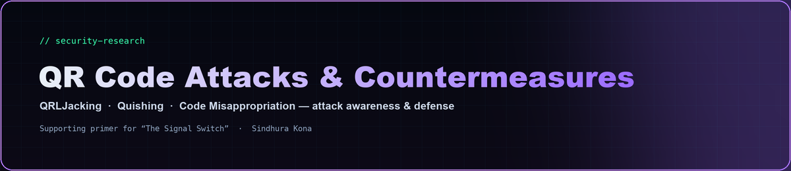
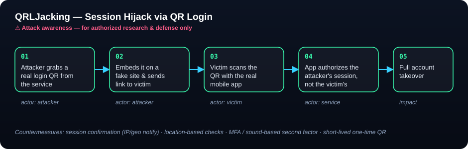
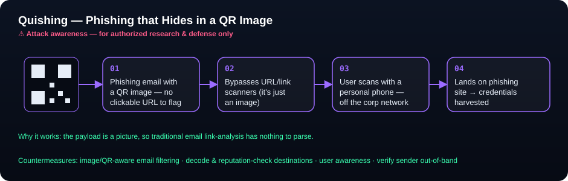

  

> A primer on how QR codes are abused in real-world attacks — and how to defend
> against them. Supporting background for the **Signal Switch** research on
> QR-based phishing delivered through trusted mobile messaging channels.
>
> ⚖️ **For authorized security research, awareness, and defense only.**

---

## Why QR codes are an attractive attack surface

A QR code is just an image, so the destination it encodes is invisible to the
human eye and often invisible to traditional link-analysis tooling. People have
also been trained to scan first and think later — usually on a **personal phone**
that sits outside corporate security controls. That combination (opaque payload +
trusted reflex + unmanaged device) is exactly what the *Signal Switch* framework
studies: the moment a user flips from skepticism to compliance.

---

## 1. QRLJacking (QR Login Jacking)

Many services let you log in by scanning a QR code instead of typing a password.
**QRLJacking** abuses that flow: the attacker relays a *legitimate* login QR
through a page they control, so when the victim scans it, the attacker's session
gets authorized instead of the victim's. It's essentially session hijacking
wrapped in a convenient login feature.

**Impact:** account takeover, plus leakage of context shared during login (device
details, approximate location, and similar metadata).

**Countermeasures**

| Defense | How it helps |
|---------|--------------|
| Session confirmation | Notify the user (email/SMS) of the login IP, location, or browser to confirm |
| Location-based checks | Compare the mobile device location with the requesting web session; mismatch → step up auth |
| Multi-factor / second factor | Require an extra factor after the scan (e.g. a sound-based confirmation replayed to the page) |
| Short-lived, one-time QR | Refresh the code each attempt so a captured code can't be replayed |

---

## 2. Quishing (QR Phishing)

**Quishing** is phishing where the malicious link is delivered as a QR image
rather than a clickable URL. Because the payload is a picture, it can slip past
email defenses that only inspect text and links — and it nudges the target onto a
personal phone to complete the attack.

Reported real-world patterns include campaigns that swapped a flagged attachment
for a QR image to evade a filter that had previously caught them, and lures
impersonating banks that told customers to scan a code to "verify" their account —
sending them to credential-harvesting sites instead. (See references.)

**Countermeasures**

- Use email security that can **decode QR images** and reputation-check the destination.
- Treat "scan to verify your account" messages as a red flag; **verify the sender out-of-band**.
- Security-awareness training that specifically covers QR lures.
- Where possible, open destinations on a managed device that enforces web filtering.

---

## 3. QR Code Misappropriation

Static QR codes can be **reused or swapped**. Two failure modes:

- **Tampering** — a physical sticker/code in a shop is replaced with an attacker's code.
- **Reuse** — a static code meant for one context gets shared/used by others (e.g. an
  ordering code posted publicly and abused).

**Countermeasures**

- Regularly inspect physical codes for tampering/replacement.
- Prefer **dynamic, one-time codes** with an aging/expiry time over static ones.
- Bind codes to context (e.g. add a random hash / per-session token).
- Consider **signed** codes (a digital signature that breaks if the content is modified)
  and **encrypted** codes (e.g. SQRC-style split of public vs. private data).
- Never store personal or sensitive data directly inside a QR code.

---

## Defender's quick checklist

- [ ] One-time, short-lived QR codes for any auth flow
- [ ] Out-of-band session confirmation + MFA after scan
- [ ] Location/IP correlation between scanner and session
- [ ] QR-aware email filtering (decode + reputation check)
- [ ] Physical-code tamper inspections
- [ ] User awareness for "scan to verify" lures
- [ ] No sensitive data encoded in codes; sign/encrypt where needed

---

## References

Primary source (structure and countermeasures adapted and rephrased from):
- HKCERT — [Introduction of QR code attacks and countermeasures](https://www.hkcert.org/blog/introduction-of-qr-code-attacks-and-countermeasures)

Further reading cited by that article:
- OWASP — [QRLJacking](https://owasp.org/www-community/attacks/Qrljacking)
- Comparitech — [What is QRLJacking?](https://www.comparitech.com/blog/information-security/what-is-QRLJacking/)
- Abnormal Security — [QR code campaign bypassing security](https://abnormalsecurity.com/blog/qr-code-campaign-bypass-security)
- Cofense — [German users targeted in QR phishing](https://cofense.com/blog/german-users-targeted-in-digital-bank-heist-phishing-campaigns/)

> *Content was rephrased and restructured for compliance with licensing restrictions; diagrams are original work.*
